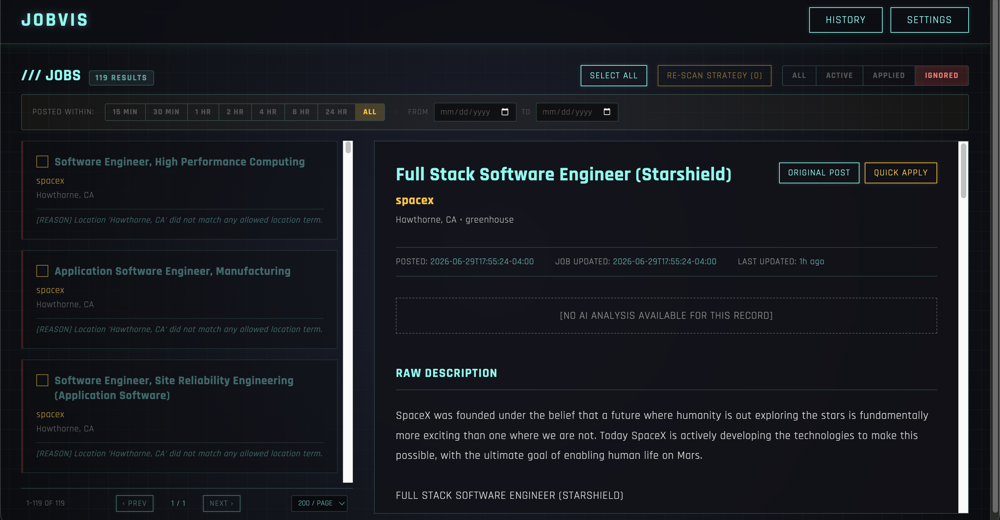
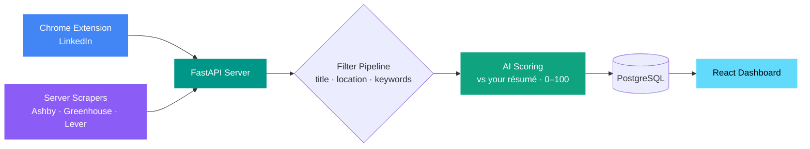
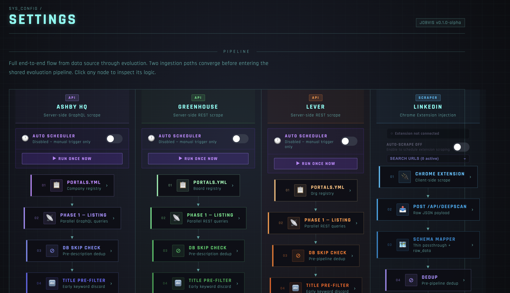

<div align="center">

# JOBVIS

**AI-Powered Job Intelligence Platform**

*Catch new jobs the moment they post — filtered, AI-scored, and ranked against your résumé.*

### 🏆 The system I built — and used to land a role at a FAANG company.

[](https://python.org)
[](https://fastapi.tiangolo.com)
[](https://reactjs.org)
[](https://typescriptlang.org)
[](https://developer.chrome.com/docs/extensions/)
[](LICENSE)

<br>



</div>

---

## What is JOBVIS?

Job hunting means scrolling through **hundreds** of postings that are mostly irrelevant — wrong seniority, wrong location, wrong stack, no sponsorship. JOBVIS does that filtering **for you**.

It pulls jobs from LinkedIn and company career pages, throws away the obvious mismatches with cheap keyword rules, then uses an AI model to **score every survivor from 0–100 against your own résumé**. What's left is a short, ranked, already-curated list you review in a clean dashboard — instead of doom-scrolling job boards.

---

## 🎯 The vision: apply within 24 hours

**Speed is the edge in job hunting.** Applying in the first day a job is posted dramatically improves your odds of landing a recruiter's eye — before the posting is buried under hundreds of applicants.

JOBVIS keeps a **local record of every posting it has ever seen**. So the moment a *brand-new* job appears that matches you, it's caught, scored, and surfaced on your dashboard — while it's still fresh. You apply early, consistently, and only to roles that actually fit.

Because JOBVIS runs **entirely on your own machine**:
- Your résumé and job data stay private (only the job text goes to the AI provider you choose — and that can be a local model too).
- To catch new jobs *continuously*, your laptop needs to be **running with JOBVIS on** (ideally 24/7).
- Want it always-on without leaving your laptop running? The design can be **extended to deploy in the cloud** — though that setup **isn't built yet** (contributions welcome).

---

## How it works (the 30-second mental model)



1. **Jobs come in two ways** — a **Chrome extension** grabs jobs as you browse (or auto-browse) **LinkedIn**, and **server-side scrapers** pull directly from company boards on **Ashby, Greenhouse, and Lever**.
2. **Cheap filters run first** — title / location / keyword rules instantly drop obvious mismatches (no AI call wasted on junk).
3. **AI scores the survivors** — each remaining job is graded 0–100 against your résumé + profile. Anything below the threshold is auto-hidden.
4. **You review the winners** — a ranked dashboard with the AI's reasoning, status/date filters, and one-click apply links.

The **Settings** page maps this exact flow — the two ingestion paths (LinkedIn extension + server scrapers) converging into the shared evaluation pipeline, where you enable each source and inspect every step:

<div align="center">
  
</div>

---

## Prerequisites

Install these **before** you start. The setup wizard checks for them and tells you if anything is missing.

| Tool | Why you need it | Get it |
|------|-----------------|--------|
| **Docker Desktop** | Runs the PostgreSQL database (no manual DB install) | [docker.com](https://www.docker.com/products/docker-desktop/) — **make sure it's running** |
| **Python 3.11+** | The backend server | [python.org](https://www.python.org/downloads/) |
| **Node.js 18+** | The dashboard UI | [nodejs.org](https://nodejs.org/) |
| **Google Chrome** | Loads the job-scraping extension | [google.com/chrome](https://www.google.com/chrome/) |
| **An AI provider** | Scores jobs against your résumé | A **free [Google Gemini API key](https://aistudio.google.com/apikey)** is easiest. Prefer 100% local/private? Use [Ollama](https://ollama.com) — no key needed. |

---

## Quick Start (first time — about 5 minutes)

> Do the steps **in order**. Step 4 (`./start.sh`) must run **before** you load the extension in step 5 — see the note there.

### 1. Get the code

```bash
git clone <your-repo-url> jobvis
cd jobvis
```

### 2. Run the setup wizard

```bash
./setup.sh
```

One command walks you through **everything** interactively:
- ✅ Checks your prerequisites (Docker, Python, Node)
- 🔑 Creates your `.env` and asks for your **AI API key** (paste your Gemini key, or press Enter to add it later)
- 📦 Installs the server (Python) and dashboard (Node) dependencies
- 👤 Asks a few questions to build your **candidate profile** (experience range, work authorization, location, salary floor…). Press Enter to skip any line.
- 🎯 Walks you through your **job filters** (which titles/keywords/locations to keep or reject), with examples. Press Enter to keep the sensible defaults.

It's **safe to re-run** anytime — it won't overwrite anything you've already set.

### 3. Add your résumé

Open **`config/cv.md`** and paste in your résumé (Markdown). This is the one thing the wizard can't do for you — it's what the AI scores jobs against.

### 4. Launch everything

```bash
./start.sh
```

This starts the **database**, the **server**, and the **dashboard** together in **production mode** (your main setup). Leave this terminal running. It's ready when the dashboard loads at **http://localhost:1997**.

### 5. Load the Chrome extension

1. Open **`chrome://extensions`** in Chrome
2. Turn on **Developer mode** (top-right toggle)
3. Click **Load unpacked** and select the **`apps/extension`** folder

> ⚠️ **Do this only after step 4.** The extension reads a file (`config.js`) that `./start.sh` generates. If you load it before the first `./start.sh`, it can't reach the server.
>
> You **don't** need to reload the extension every run — only if you later switch between prod and dev mode (the port changes).

### 6. Open the dashboard and scan

1. Go to **http://localhost:1997**
2. Open the **Settings** page to enable the job scrapers (Ashby / Greenhouse / Lever) or trigger a run
3. Or browse LinkedIn with the extension active to feed in LinkedIn jobs
4. Watch jobs flow into the **Home** page — keyword-filtered and saved

🎉 That's it. From now on you only ever need **`./start.sh`** to run JOBVIS.

> [!IMPORTANT]
> ### ⚠️ AI scoring is intentionally OFF on your first runs
> When JOBVIS first scans, it pulls in **every** job it can find — and most of them aren't worth spending AI tokens on. So AI scoring starts **disabled**: the early runs just **collect and keyword-filter** jobs into your database — fast, free, and no AI calls.
>
> Once jobs are flowing in and your filters look right, **turn on AI scoring from the Settings page**. From then on, new jobs are automatically graded **0–100 against your résumé** and low scorers are hidden. To score the jobs you *already* collected, select them on **Home** and hit **Re-Scan**.

---

## Running JOBVIS day-to-day

### Start it (production — the normal way)
```bash
./start.sh
```
Dashboard: **http://localhost:1997** · Server API: `http://localhost:8001`

Keep this running to keep catching new jobs. Stop it with **Ctrl-C**.

### Development mode (optional — isolated test data)
```bash
./start.sh dev
```
Dashboard: **http://localhost:5173** · Server API: `http://localhost:8000`

Dev mode uses a **completely separate database** (`jobvisdb_dev`) and separate ports, so you can experiment — new filters, a different résumé, testing changes — **without touching your real production job data**. You can even run prod and dev at the same time; they never collide.

> If you switch between prod and dev, **reload the extension** in `chrome://extensions` afterward (its port changes).

### Getting jobs in

| Source | How | Configure in |
|--------|-----|--------------|
| **LinkedIn** | Browse LinkedIn jobs with the extension active, or let it **auto-scrape** your saved searches on a timer | Extension popup + `linkedin_search_urls` in `config/portals.yml` |
| **Ashby / Greenhouse / Lever** | The server pulls these directly from company career boards — trigger from the **Settings** page, or let the scheduler run them automatically | `tracked_companies` in `config/portals.yml` + toggles on the Settings page |

### The dashboard

- **Home** — your ranked job list. Filter by **status** (Active / Applied / Ignored) and **posted-within** time windows, page through results, and select jobs to **Re-Scan**, change status, or delete. Click a job to see the AI score, its reasoning, and the full description.
- **Settings** — turn AI scoring on/off, enable each scraper and set how often it runs, manage tracked companies + LinkedIn searches, and see the extension's live connection status.
- **History** — every scan run and how many jobs it found / saved / ignored.

### Re-scanning after you change something
Changed your résumé, filters, or profile? Select jobs on **Home** and hit **Re-Scan** — JOBVIS re-evaluates them against your new rules without re-scraping.

---

## ⚙️ Configuration — every file explained

All your settings live in the **`config/`** folder (plus a root `.env`). This is where you'll spend your tuning time. The **setup wizard fills most of it in for you**; this section explains what each file and option does so you never get stuck.

> After editing any config file, the change is picked up on the **next scan** — no restart needed. (Editing `.env` or `config/llm_config.yml` does need a restart, since those load at startup.)

<details>
<summary><b>📖 Click to expand — full reference for every config file &amp; option</b></summary>

<br>

### `.env` — your secret API keys
Created by the wizard from `.env.example`. Holds the API key for your AI provider. **Never commit this file** (it's gitignored).
```bash
GEMINI_API_KEY=your-key-here      # needed if using Gemini
GROQ_API_KEY=                     # needed if using Groq
# Local providers (Ollama, MLX) need no key.
```

### `config/cv.md` — your résumé
Plain Markdown résumé. It's injected into the AI prompt and is **what every job is scored against**. The more accurate and complete it is, the better your scores. You edit this by hand.

### `apps/server/prompts/JobMatchAnalyst.md` — your candidate profile + scoring rules
*(Lives in `apps/server/prompts/`, not `config/`, but it's a config you own.)* The **wizard fills the `CANDIDATE PROFILE` block** at the top:
```
## CANDIDATE PROFILE
- Experience: 3-5 years
- Work authorization: Needs H-1B sponsorship
- Clearance: No clearance eligibility
- Location: WA state or fully remote USA
- Employment type: Full-time only
- Salary floor: $150,000/year
```
These drive the AI's **knockout rules** — e.g. a job requiring 10+ years, demanding a clearance you don't have, or paying below your floor is auto-scored 0. **Skip any line** (leave it out) and that rule simply isn't enforced. Everything below the profile block is the generic scoring logic — you normally don't touch it.

### `config/filter.yml` — the cheap pre-filters (run before the AI)
These keyword rules drop obvious mismatches *before* spending an AI call. Every list is **case-insensitive**. The wizard sets these up, but here's each section:

```yaml
title_filter:
  include_any:          # Job TITLE must contain AT LEAST ONE of these, or it's skipped.
    - "Software Engineer"  #   Keep this BROAD — it's your first gate.
    - "Backend"
  exclude_any:          # Job TITLE is INSTANTLY rejected if it contains ANY of these.
    - "Junior"             #   Great for killing seniority/stack mismatches.
    - "Manager"

job_description_filter:
  include_any:          # The DESCRIPTION must mention AT LEAST ONE of these (your core stack).
    - "Java"
  exclude_any:          # Reject if the DESCRIPTION contains ANY of these (hard dealbreakers).
    - "US citizen"

  description_pattern_excludes:   # Advanced: REGEX patterns. If any matches the description, reject.
    # Example below drops hourly/contract postings like "$40 – $150/hour", "$25/hr", "45/hour":
    - '\$?\d+(?:\.\d+)?\s*(?:–|-|to)\s*\$?\d+(?:\.\d+)?\s*/\s*h(?:ou)?r'

location_filter:
  include_any:          # Only jobs whose LOCATION matches one of these pass.
    - "remote"             #   A blank/unknown location passes through (the AI judges it).
    - "Seattle"
    - ", wa"
```

**When to use what:**
- Use **`title_filter.include_any`** to define the *kinds* of roles you want (keep it broad — titles vary wildly).
- Use **`exclude_any`** lists to hard-kill things you never want (wrong seniority, tech you won't touch, clearance requirements).
- Use **`description_pattern_excludes`** for patterns keywords can't catch — the built-in example filters out **hourly/contract** roles by detecting pay like `$50/hour`.
- Use **`location_filter`** to restrict geography. Leave it empty to accept everywhere.

### `config/llm_config.yml` — which AI model scores your jobs
A list of providers; the **active one** (marked `active: true`, or the first uncommented entry) is used. Switch providers by commenting/uncommenting blocks. *(Restart after changing.)*
```yaml
llm-providers:
  - provider: gemini              # cloud — needs GEMINI_API_KEY in .env
    name: gemini-flash
    model: gemini-2.0-flash
    mode: cloud
    concurrency: 3                # how many jobs to score in parallel

  # - provider: ollama            # local — 100% private, no key
  #   name: ollama-local
  #   model: qwen2.5:7b
  #   mode: local
  #   url: http://localhost:11434
```
| Field | Meaning |
|-------|---------|
| `provider` | `gemini`, `groq`, `ollama`, or `mlx` |
| `model` | The exact model name for that provider |
| `mode` | `cloud` or `local` (affects default concurrency) |
| `url` | Endpoint for local providers (Ollama/MLX) |
| `concurrency` | Jobs scored in parallel (higher = faster, more load) |
| `keep_alive` / `num_ctx` / `num_predict` | Ollama tuning (memory retention, context size, output cap) |

### `config/portals.yml` — where to scrape jobs from
Two independent lists.

**1. `linkedin_search_urls`** — the searches the Chrome extension auto-scrapes. Paste any LinkedIn Jobs **search URL** (do your search on LinkedIn, copy the address bar):
```yaml
linkedin_search_urls:
  - name: "Software Engineer — last 24h — Seattle"
    url: "https://www.linkedin.com/jobs/search/?keywords=software%20engineer&..."
    enabled: true    # set false to pause this search without deleting it
```

**2. `tracked_companies`** — the company boards the server scrapes directly. The `slug` is the company's handle in its board URL:
```yaml
tracked_companies:
  - name: Pinecone
    source: ashby           # ashby | greenhouse | lever
    slug: pinecone          # from jobs.ashbyhq.com/<slug>
    enabled: true
  - name: Airbnb
    source: greenhouse
    slug: airbnb            # from boards.greenhouse.io/<slug>
    enabled: true
```
> Find the slug from the board URL: `jobs.ashbyhq.com/`**`pinecone`**, `boards.greenhouse.io/`**`airbnb`**, `jobs.lever.co/`**`netflix`**.

### `config/settings.prod.yml` & `config/settings.dev.yml` — runtime toggles
Per-environment switches. **You usually manage these from the Settings page in the dashboard**, not by hand.
```yaml
pipeline:
  ai_scoring_enabled: true              # false = skip the AI entirely (filters only)
  ashby_description_fetch_enabled: true # fetch full descriptions when scraping Ashby
scheduler:
  ashby:      { enabled: true, interval_minutes: 120 }   # auto-scrape Ashby every 2h
  greenhouse: { enabled: true, interval_minutes: 120 }
  lever:      { enabled: true, interval_minutes: 120 }
  linkedin:   { enabled: true, interval_minutes: 120 }   # tells the extension how often to auto-scrape
```
`settings.prod.yml` applies to `./start.sh`; `settings.dev.yml` applies to `./start.sh dev`.

</details>

---

## Choosing your AI provider

| Provider | Type | Needs a key? | Notes |
|----------|------|:------------:|-------|
| **Gemini** | Cloud | Yes ([free tier](https://aistudio.google.com/apikey)) | Default. Easiest to start with. |
| **Groq** | Cloud | Yes ([key](https://console.groq.com/keys)) | Very fast inference. |
| **Ollama** | Local | No | 100% private/offline. Requires [Ollama](https://ollama.com) running. |
| **MLX** | Local (Apple Silicon) | No | Fast on M-series Macs. Requires an `mlx_lm` server. |

> **Heads-up:** the server **won't start** if its AI provider is unreachable (missing/invalid key, or a local model that isn't running). This is intentional — it refuses to run half-configured. If startup halts, check this first.

---

## Troubleshooting

| Symptom | Fix |
|---------|-----|
| `./setup.sh` says Docker isn't running | Open Docker Desktop, wait for it to fully start, re-run. |
| Server exits immediately on `./start.sh` | AI provider unreachable — check the key in `.env`, or that your local model (Ollama/MLX) is running. |
| Extension can't connect / does nothing | Run `./start.sh` **before** loading it. If you switched prod↔dev, reload the extension in `chrome://extensions`. |
| Dashboard is empty | You haven't scanned yet — enable a scraper on **Settings**, or browse LinkedIn with the extension. Also check the status filter isn't hiding everything. |
| "Port already in use" | A previous run is still going. Ctrl-C it (or free the port), then `./start.sh` again. |
| Jobs get scraped but never scored | AI scoring may be **off** on the Settings page — turn it on. |
| `permission denied: ./setup.sh` | Run `chmod +x setup.sh start.sh` once, or use `bash setup.sh`. |
| I edited a filter but nothing changed | Filters apply on the **next scan**. To re-apply to existing jobs, select them on **Home** and hit **Re-Scan**. |

---

## Architecture

Want the deep dive — the full pipeline, dedup/cache logic, scheduler, multi-provider AI engine, and database schema? See **[ARCHITECTURE.md](ARCHITECTURE.md)**.

| Layer | Technology |
|-------|-----------|
| Chrome Extension | JavaScript, Chrome MV3 |
| Backend | Python, FastAPI, SQLAlchemy |
| Database | PostgreSQL (via Docker) |
| AI Engine | Gemini · Groq · Ollama · MLX (pluggable) |
| Scrapers | Ashby, Greenhouse, Lever (server) + LinkedIn (extension) |
| Frontend | React 18, TypeScript, Vite |
| Scheduler | Custom asyncio scheduler |

---

## Repository layout

```
jobvis/
├── setup.sh              # one-time interactive setup wizard   ← run first
├── start.sh              # launches DB + server + UI (prod)    ← run every time
│                         #   './start.sh dev' = isolated dev environment
├── docker-compose.yml    # PostgreSQL + Adminer
├── .env.example          # copy to .env (the wizard does this)
├── config/               # all your settings (see the section above)
└── apps/
    ├── extension/        # Chrome MV3 extension (LinkedIn)
    ├── server/           # FastAPI backend (scrapers, pipeline, AI engine)
    └── ui/               # React + TypeScript dashboard
```

---

## License

Released under the [MIT License](LICENSE).

---

## Author

**Sundeep Dayalan** · [Portfolio](https://sundeepdayalan.in) · [LinkedIn](https://linkedin.com/in/sundeep-dayalan)
