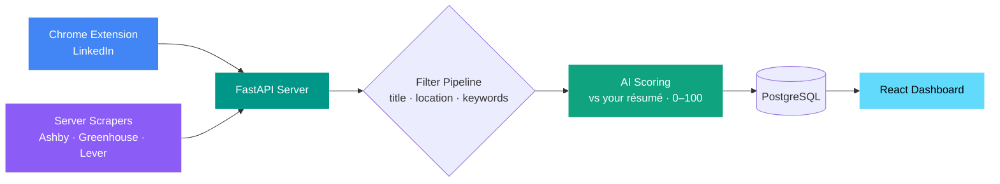

<div align="center">

# JOBVIS

**AI-Powered Job Intelligence Platform**

*Scrape → Filter → Match → Track — all on your own machine*

[](https://python.org)
[](https://fastapi.tiangolo.com)
[](https://reactjs.org)
[](https://typescriptlang.org)
[](https://developer.chrome.com/docs/extensions/)
[](LICENSE)

</div>

---

## What is JOBVIS?

Job hunting means scrolling through **hundreds** of postings that are mostly irrelevant — wrong seniority, wrong location, wrong stack, no sponsorship. JOBVIS does that filtering **for you**.

It pulls jobs from LinkedIn and company career pages, throws away the obvious mismatches with cheap keyword rules, then uses an AI model to **score every survivor from 0–100 against your own résumé**. What's left is a short, ranked, already-curated list you review in a clean dashboard — instead of doom-scrolling job boards.

Everything runs **locally on your machine**. Your résumé and job data never leave your computer (except the job text sent to your chosen AI provider for scoring — and you can even run that locally too).

---

## How it works (the 30-second mental model)



1. **Jobs come in two ways**
   - A **Chrome extension** grabs jobs as you browse (or auto-browse) **LinkedIn**.
   - **Server-side scrapers** pull directly from company boards on **Ashby, Greenhouse, and Lever**.
2. **Cheap filters run first** — title / location / keyword rules instantly drop obvious mismatches (saves money — no AI call for junk).
3. **AI scores the survivors** — each remaining job is graded 0–100 against your résumé + your profile (experience range, location, salary floor, sponsorship, etc.). Anything scoring below the threshold is auto-hidden.
4. **You review the winners** in a dashboard — a ranked list with the AI's reasoning, filters by status and date, and one-click apply links.

---

## Prerequisites

Install these **before** you start. The setup wizard will check for them and tell you if anything's missing.

| Tool | Why you need it | Get it |
|------|-----------------|--------|
| **Docker Desktop** | Runs the PostgreSQL database (no manual DB install) | [docker.com](https://www.docker.com/products/docker-desktop/) — **make sure it's running** |
| **Python 3.11+** | The backend server | [python.org](https://www.python.org/downloads/) |
| **Node.js 18+** | The dashboard UI | [nodejs.org](https://nodejs.org/) |
| **Google Chrome** | Loads the job-scraping extension | [google.com/chrome](https://www.google.com/chrome/) |
| **An AI provider** | Scores jobs against your résumé | A **free [Google Gemini API key](https://aistudio.google.com/apikey)** is the easiest. Prefer 100% local/private? Use [Ollama](https://ollama.com) — no key needed. |

---

## Quick Start (first time — about 5 minutes)

> Do the steps **in order**. Step 4 (`./start.sh`) must run **before** you load the extension in step 5 — that's not optional (see the note in step 5).

### 1. Get the code

```bash
git clone <your-repo-url> jobvis
cd jobvis
```

### 2. Run the setup wizard

```bash
./setup.sh
```

This one command walks you through **everything** interactively:
- ✅ Checks your prerequisites (Docker, Python, Node)
- 🔑 Creates your `.env` and asks for your **AI API key** (paste your Gemini key, or press Enter to add it later)
- 📦 Installs the server (Python) and dashboard (Node) dependencies
- 👤 Asks a few questions to build your **candidate profile** (experience range, work authorization, location, salary floor…). Press Enter to skip any line — skipped items simply aren't enforced.
- 🎯 Walks you through your **job filters** (which titles/keywords/locations to keep or reject), with examples. Press Enter to keep the sensible defaults.

It's **safe to re-run** anytime — it won't overwrite anything you've already set.

### 3. Add your résumé

Open **`config/cv.md`** and paste in your résumé (Markdown format). This is the one thing the wizard can't do for you, and it's what the AI scores jobs against.

### 4. Launch everything

```bash
./start.sh
```

This starts the **database**, the **server**, and the **dashboard** together. Leave this terminal running. You'll know it's ready when the dashboard is reachable at **http://localhost:5173**.

### 5. Load the Chrome extension

1. Open **`chrome://extensions`** in Chrome
2. Turn on **Developer mode** (top-right toggle)
3. Click **Load unpacked** and select the **`apps/extension`** folder

> ⚠️ **Do this only after step 4.** The extension reads a file called `config.js` that `./start.sh` generates. If you load it before the first `./start.sh`, it won't be able to reach the server.
>
> You **don't** need to reload the extension every time you run `./start.sh` — only if you later switch between dev and prod mode (the port changes).

### 6. Open the dashboard and scan

1. Go to **http://localhost:5173**
2. Open the **Settings** page to turn on the job scrapers (Ashby / Greenhouse / Lever) or trigger a run
3. Or browse LinkedIn with the extension active to feed in LinkedIn jobs
4. Watch results appear on the **Home** page — ranked, scored, and filtered

🎉 That's it. From now on, you only ever need **`./start.sh`** to run JOBVIS.

---

## Using JOBVIS day-to-day

### Starting it up
```bash
./start.sh          # dev mode  — dashboard at http://localhost:5173
./start.sh --prod   # prod mode — dashboard at http://localhost:1997
```
Both use their own database and ports, so you can even run them side by side.

### Getting jobs in

| Source | How | Where to configure |
|--------|-----|--------------------|
| **LinkedIn** | Browse LinkedIn jobs with the extension active, or let it **auto-scrape** your saved searches on a timer | Extension popup + `linkedin_search_urls` in `config/portals.yml` |
| **Ashby / Greenhouse / Lever** | The server pulls these directly from company career boards — trigger from the **Settings** page, or let the scheduler run them automatically | `tracked_companies` in `config/portals.yml` + toggles on the Settings page |

### The dashboard

- **Home** — your ranked job list. Filter by **status** (Active / Applied / Ignored) and by **posted-within** time windows, page through results, and select jobs to **Re-Scan**, move status, or delete. Click any job to see the AI's score + reasoning and the full description.
- **Settings** — turn AI scoring on/off, enable/disable each scraper and set how often it runs, manage your tracked companies and LinkedIn searches, and see the extension's live connection status.
- **History** — every scan run and how many jobs it found/saved/ignored.

### Re-scanning after you change something

Changed your résumé (`cv.md`), your filters (`filter.yml`), or your profile? Select jobs on the **Home** page and hit **Re-Scan** — JOBVIS re-evaluates them against your new rules without re-scraping anything.

---

## Configuration reference

Everything lives in `config/` plus a root `.env`. The **wizard sets most of this up for you** — this table is for when you want to tweak things later.

| File | What it controls | Set by wizard? |
|------|------------------|:--------------:|
| `.env` | Your AI provider API key(s) | ✅ |
| `config/cv.md` | Your résumé (fed to the AI scorer) | ✍️ you paste it |
| `apps/server/prompts/JobMatchAnalyst.md` | Your **candidate profile** (experience, location, salary floor, sponsorship…) that drives the AI knockout rules | ✅ |
| `config/filter.yml` | The cheap pre-filters: which **titles**, **description keywords**, and **locations** to keep or reject | ✅ |
| `config/llm_config.yml` | Which AI provider is active (Gemini / Groq / Ollama / MLX) | pick during wizard |
| `config/portals.yml` | LinkedIn search URLs + the company boards (Ashby/Greenhouse/Lever slugs) to scrape | edit anytime |
| `config/settings.dev.yml` / `settings.prod.yml` | Runtime toggles: AI scoring on/off, scraper schedules (also editable live from the Settings page) | Settings page |

---

## Choosing your AI provider

JOBVIS supports four backends — set the active one in `config/llm_config.yml` (the wizard helps you pick):

| Provider | Type | Needs a key? | Notes |
|----------|------|:------------:|-------|
| **Gemini** | Cloud | Yes ([free tier](https://aistudio.google.com/apikey)) | Default. Easiest to start with. |
| **Groq** | Cloud | Yes ([key](https://console.groq.com/keys)) | Very fast inference. |
| **Ollama** | Local | No | 100% private/offline. Requires [Ollama](https://ollama.com) running. |
| **MLX** | Local (Apple Silicon) | No | Fast on M-series Macs. Requires an `mlx_lm` server. |

> **Heads-up:** the server **won't start** if its AI provider is unreachable (e.g. missing/invalid key, or your local model isn't running). This is intentional — it refuses to run half-configured. If startup halts, that's the first thing to check.

---

## Troubleshooting

| Symptom | Fix |
|---------|-----|
| `./setup.sh` says Docker isn't running | Open Docker Desktop and wait for it to fully start, then re-run. |
| Server exits immediately on `./start.sh` | Your AI provider is unreachable. Check the API key in `.env`, or that your local model (Ollama/MLX) is running. |
| Extension can't connect / does nothing | Make sure you ran `./start.sh` **before** loading it. If you switched dev↔prod, reload the extension in `chrome://extensions`. |
| Dashboard is empty | You haven't scanned yet — enable a scraper on the **Settings** page, or browse LinkedIn with the extension. Also check the status filter isn't hiding everything. |
| "Port already in use" | A previous run is still going. Stop it (Ctrl-C in its terminal) or free the port, then `./start.sh` again. |
| Jobs get scraped but never scored | AI scoring may be toggled **off** on the Settings page — turn it on. |
| `permission denied: ./setup.sh` | Run `chmod +x setup.sh start.sh` once, or use `bash setup.sh`. |

---

## Architecture

Want the deep dive — the full pipeline, dedup/cache logic, scheduler, multi-provider AI engine, and database schema? See **[ARCHITECTURE.md](ARCHITECTURE.md)**.

| Layer | Technology |
|-------|-----------|
| Chrome Extension | JavaScript, Chrome MV3 |
| Backend | Python, FastAPI, SQLAlchemy |
| Database | PostgreSQL (via Docker) |
| AI Engine | Gemini · Groq · Ollama · MLX (pluggable) |
| Scrapers | Ashby, Greenhouse, Lever (server) + LinkedIn (extension) |
| Frontend | React 18, TypeScript, Vite |
| Scheduler | Custom asyncio scheduler |

---

## Repository layout

```
jobvis/
├── setup.sh              # one-time interactive setup wizard  ← run first
├── start.sh              # launches DB + server + UI          ← run every time
├── docker-compose.yml    # PostgreSQL + Adminer
├── .env.example          # copy to .env (the wizard does this)
├── config/               # all your settings (CV, filters, providers, portals)
└── apps/
    ├── extension/        # Chrome MV3 extension (LinkedIn)
    ├── server/           # FastAPI backend (scrapers, pipeline, AI engine)
    └── ui/               # React + TypeScript dashboard
```

---

## License

Released under the [MIT License](LICENSE).

---

## Author

**Sundeep Dayalan** · [Portfolio](https://sundeepdayalan.in) · [LinkedIn](https://linkedin.com/in/sundeep-dayalan)
