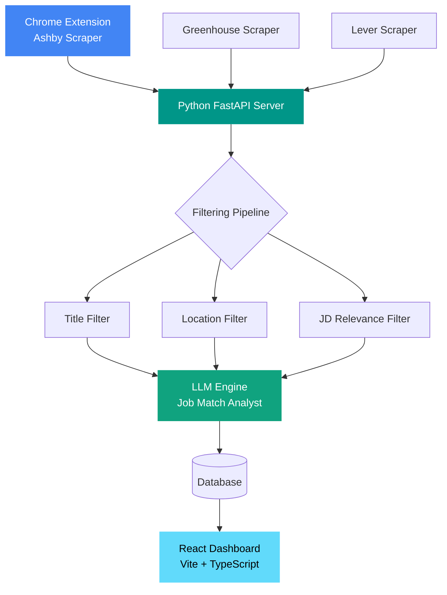

<div align="center">

# JOBVIS

**AI-Powered Job Intelligence Platform**

*Scrape → Filter → Match → Track — all in one intelligent pipeline*

[](https://python.org)
[](https://fastapi.tiangolo.com)
[](https://reactjs.org)
[](https://typescriptlang.org)
[](https://developer.chrome.com/docs/extensions/)

</div>

---

## Overview

JOBVIS is a monorepo combining a **Chrome extension**, **Python AI server**, and **React dashboard** to automate the job search pipeline. It scrapes job postings from Ashby, Greenhouse, and Lever — then uses an LLM pipeline to filter, score, and match roles against your CV in real time.

No more manually scrolling through hundreds of irrelevant postings.

---

## Architecture



---

## Tech Stack

| Layer | Technology |
|-------|-----------|
| Chrome Extension | JavaScript, Chrome MV3 |
| Backend | Python, FastAPI |
| AI Engine | LLM, Prompt Engineering |
| Scrapers | Ashby, Greenhouse, Lever |
| Frontend | React 18, TypeScript, Vite |
| Scheduler | Custom asyncio scheduler |

---

## Monorepo Structure

```
JOBVIS/
├── apps/
│   ├── extension/          # Chrome MV3 extension (Ashby scraper)
│   │   ├── manifest.json
│   │   ├── background.js
│   │   ├── content.js
│   │   └── popup.*
│   ├── server/             # Python FastAPI backend
│   │   ├── main.py
│   │   ├── llm_engine.py
│   │   ├── scheduler.py
│   │   ├── pipeline/       # JD / title / location filters
│   │   ├── scrapers/       # Ashby, Greenhouse, Lever
│   │   └── prompts/        # LLM prompt templates
│   └── ui/                 # React + TypeScript dashboard
└── README.md
```

---

## Key Features

- **Multi-source scraping** — Ashby, Greenhouse, and Lever job boards
- **AI-powered matching** — LLM scores each job against your CV and target criteria
- **Smart filtering pipeline** — title, location, and JD relevance filters before LLM call
- **Scheduled ingestion** — a built-in asyncio scheduler runs the ATS scrapers automatically
- **Chrome Extension** — capture jobs directly from LinkedIn in your browser

---

## Getting Started

### 1. Configure (do this first)

JOBVIS is driven entirely by files in `config/` plus a root `.env`. Set these up before running:

| File | What to put there |
|------|-------------------|
| `.env` | Copy `.env.example` → `.env` and add the API key for your LLM provider. Local providers (Ollama/MLX) need no key. |
| `config/cv.md` | Your résumé — injected into the AI scoring prompt. |
| `apps/server/prompts/JobMatchAnalyst.md` | Fill in the `CANDIDATE PROFILE` block (experience range, work authorization, location, salary floor). |
| `config/filter.yml` | Title / location / job-description keyword filters that run before the LLM. |
| `config/llm_config.yml` | Select your active LLM provider (Gemini, Groq, Ollama, or MLX). |
| `config/portals.yml` | *(Optional)* Company boards + LinkedIn search URLs to scrape. |

```bash
cp .env.example .env   # then edit .env and add your API key
```

### 2. Server

```bash
cd apps/server
python -m venv venv && source venv/bin/activate
pip install -r requirements.txt
python main.py
```

### 3. Chrome Extension

1. Open `chrome://extensions`
2. Enable **Developer mode**
3. Click **Load unpacked** → select `apps/extension`

### 4. Dashboard UI

```bash
cd apps/ui
npm install
npm run dev
```

---

## Author

**Sundeep Dayalan** · [Portfolio](https://sundeepdayalan.in) · [LinkedIn](https://linkedin.com/in/sundeep-dayalan)

---

## License

Released under the [MIT License](LICENSE).
